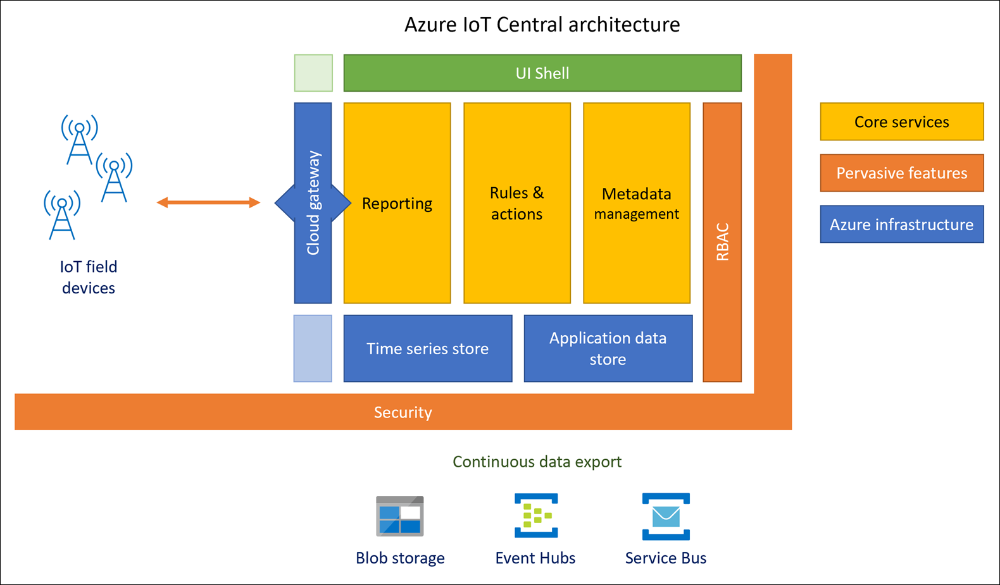

# Predictive Maintenance for remote field devices hands-on lab step-by-step

## Abstract and learning objectives

In this hands-on lab, you will build an end-to-end industrial IoT solution. We will begin by leveraging the Azure IoT Central SaaS offerings to stand up a fully functional remote monitoring solution quickly. Azure IoT Central provides solutions built upon recommendations found in the [Azure IoT Reference Architecture](https://docs.microsoft.com/en-us/azure/architecture/reference-architectures/iot/). We will customize this system specifically for rod pumps. Rod pumps are standard industrial equipment found in the oil and gas industry. We will then establish a model for the telemetry data received from the pump systems in the field and use this model to deploy simulated devices for system testing purposes.

Furthermore, we will establish threshold rules in the remote monitoring system that will monitor the incoming telemetry data to ensure all equipment is running optimally and alert us whenever the equipment is running outside of normal boundaries. Anomalies indicate the need for alternative running parameters, maintenance, or a complete shutdown of the pump. By leveraging the IoT Central solution, users can also issue commands to the pumps from a remote location in an instant to automate many operational and maintenance tasks which used to require staff on-site. Automation lessens operating costs associated with technician dispatch and equipment damage due to a failure.

Above and beyond real-time monitoring and mitigating immediate equipment damage through commanding, you will also learn how to apply the historical telemetry data accumulated to identify positive and negative trends used to adjust daily operations for higher throughput and reliability.

## Overview

The Predictive Maintenance for Remote Field Devices hands-on lab is an exercise that will challenge you to implement an end-to-end scenario using the supplied example based on Azure IoT Central and other related Azure services. It is beneficial to pair up with other members at the lab to model a real-world experience and allow each member to share their expertise for the overall solution rather than implementing the lab independently.

## Solution architecture

[Azure IoT Central](https://docs.microsoft.com/azure/iot-central/overview-iot-central) is at the core of the preferred solution. It is used for data ingest, device management, data storage, and reporting. IoT field devices securely connect to IoT Central through its cloud gateway. The continuous export component sends device telemetry data to [Azure Blob storage](https://docs.microsoft.com/azure/storage/blobs/storage-blobs-overview) for cold storage, and the same data to [Azure Event Hubs](https://docs.microsoft.com/azure/event-hubs/event-hubs-about) for real-time processing. Azure Databricks uses the data stored in cold storage to periodically re-train a Machine Learning (ML) model to detect oil pump failures. It is also used to deploy the trained model to a web service hosted by [Azure Kubernetes Service](https://docs.microsoft.com/azure/aks/) (AKS) or [Azure Container Instances](https://docs.microsoft.com/azure/container-instances/) (ACI), using [Azure Machine Learning](https://docs.microsoft.com/azure/machine-learning/service/overview-what-is-azure-ml). An [Azure function](https://docs.microsoft.com/azure/azure-functions/functions-overview) is triggered by events flowing through Event Hubs. It sends the event data for each pump to the web service hosting the deployed model, then sends an alert through [Microsoft Power Automate](https://flow.microsoft.com/) if an alert has not been sent within a configurable period of time. The alert is sent in the form of an email, identifying the failing oil pump with a suggestion to service the device.

_Azure IoT Central architecture_

The diagram above shows the components of IoT Central's architecture that pertain to Fabrikam's use case. Because it is a SaaS-based solution, the Azure services IoT Central uses are hidden from view. IoT field devices securely connect to IoT Central through its cloud gateway. The gateway uses Azure IoT Hub Device Provisioning Service (DPS) to streamline device management, and the underlying IoT Hub service facilitates bi-directional communication between the cloud and IoT devices. All device telemetry is stored in a time series data store, based on Azure Time Series Insights. The application data store persists the IoT Central application and its customizations. This application provides a user interface shell, through which Fabrikam's users manage devices and associated metadata, view dashboards and reports, and configure rules and actions to react to device telemetry that indicates possible rod pump failure. Pervasive throughout the end-to-end solution is security in transit and at rest for devices and the web-based management application. The continuous data export feature is used to enable hot and cold path workloads on real-time and batch device telemetry and metadata, using external services. Batch data is exported to Azure Blob storage in Apache Avro file format each minute, and real-time data is exported to either Azure Event Hubs or Azure Service Bus.
