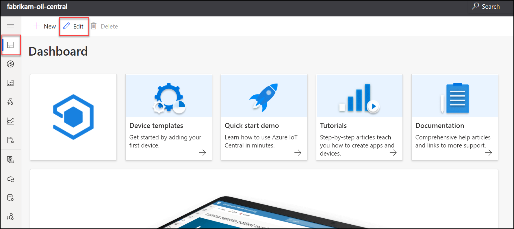
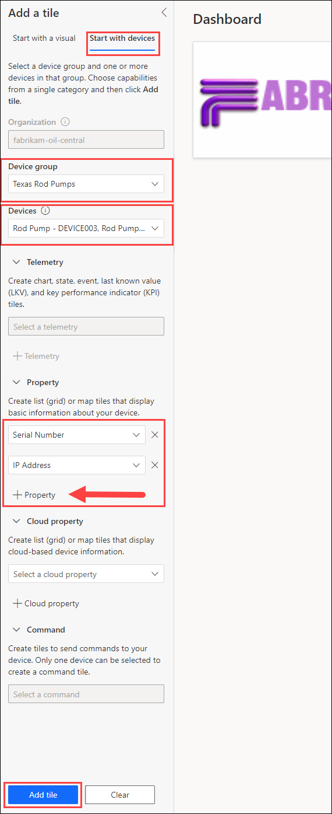
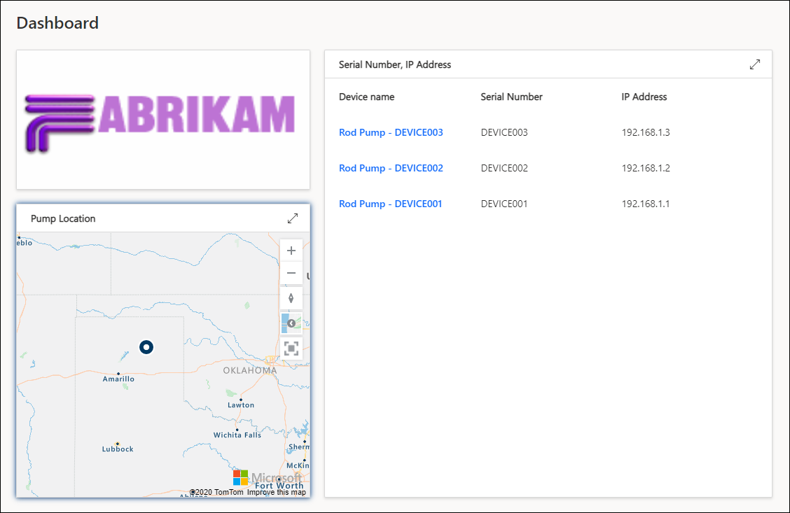

## Exercise 4: Creating a useful dashboard

Duration: 30 minutes

One of the main features of IoT Central is the ability to visualize the health of your IoT system at a glance. Creating a customized dashboard that best fits your business is instrumental in improving business processes. In this exercise, we will go over adding a main dashboard that will be displayed upon entry to the IoT Central application.

### Task 1: Clearing out the default dashboard

1. In the left-hand menu, select the _Dashboard_ item. Then, select the _Edit_ button.

    

2. Expand the ellipsis menu on each tile that you do not wish to see on the dashboard and select _Delete_ to remove them. Some tiles are deleted by selecting the _X_ button on the tile.

    

### Task 2: Add your company logo

1. Remaining in the edit mode of the dashboard, select _Image_ from the _Custom tiles_ section of the menu. Select _Add tile_.

    

2. Once the tile is added to the design surface, expand the ellipsis menu on the tile, and select _Configure_. Configure the logo with the following file _C:\MCW-Predictive-Maintenance-for-remote-field-devices-master\Hands-on lab\media\fabrikam-logo.png_. Select the _Update_ button once complete.

    

3. Resize the logo on the dashboard using the handle on the lower right of the logo tile.

    

### Task 3: Add a list of Texas Rod Pumps

In the previous exercise, we created a device group that contains the devices located in Texas. We will leverage this device set to display this filtered information.

1. Remaining in the edit dashboard mode, select _Texas Rod Pumps_ from the _Device group_ dropdown, then select each of the devices in the _Devices_ list.

2. In the _Property_ section, select the _Serial Number_, and _IP Address_ properties. Add properties by selecting the _+ Property_ button. Once complete, select the _Add tile_ button.

    

    

### Task 4: Add a map displaying the locations of the Texas Rod Pumps

It is beneficial to see the location of certain critical Texas rod pumps. We will add a map that will display the location of each of the Texas Rod Pump devices.

1. Return to the _Edit_ view of the Dashboard. As in the previous task, select the _Texas Rod Pumps_ and all the devices in the _Devices_ list. In the _Property_ drop down, select _Pump Location_.Select _Add tile_, then select _Save_ from the Dashboard toolbar menu.

    

2. Observe how the device group now has a map displaying markers for each device in the set. Feel free to adjust to zoom to better infer their location.

3. Return to the edit view of the Dashboard and experiment adding additional visualizations relative to the Texas Rod Pump device group. For instance, add a tile that shows the Motor Power data for all of the devices in a single chart.

    
