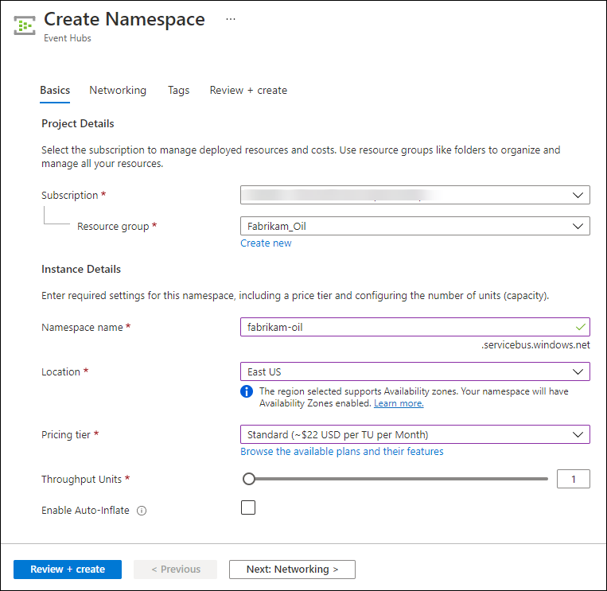
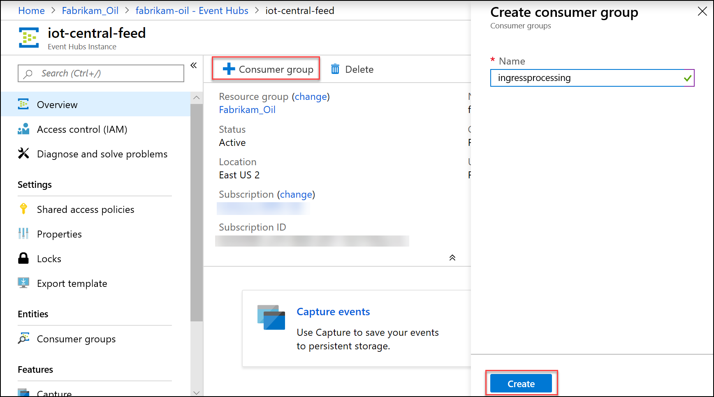
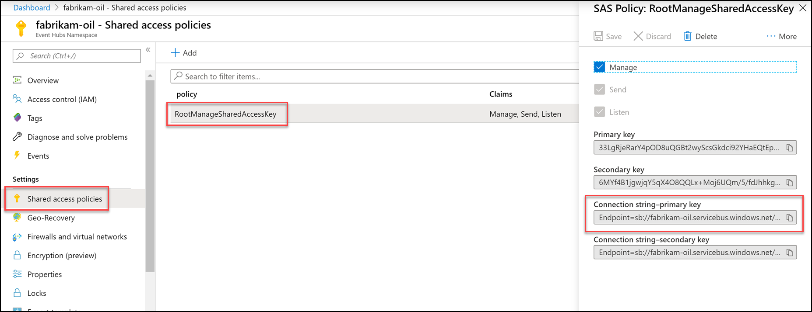
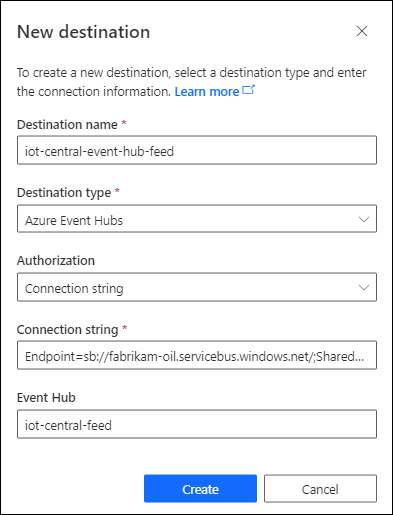
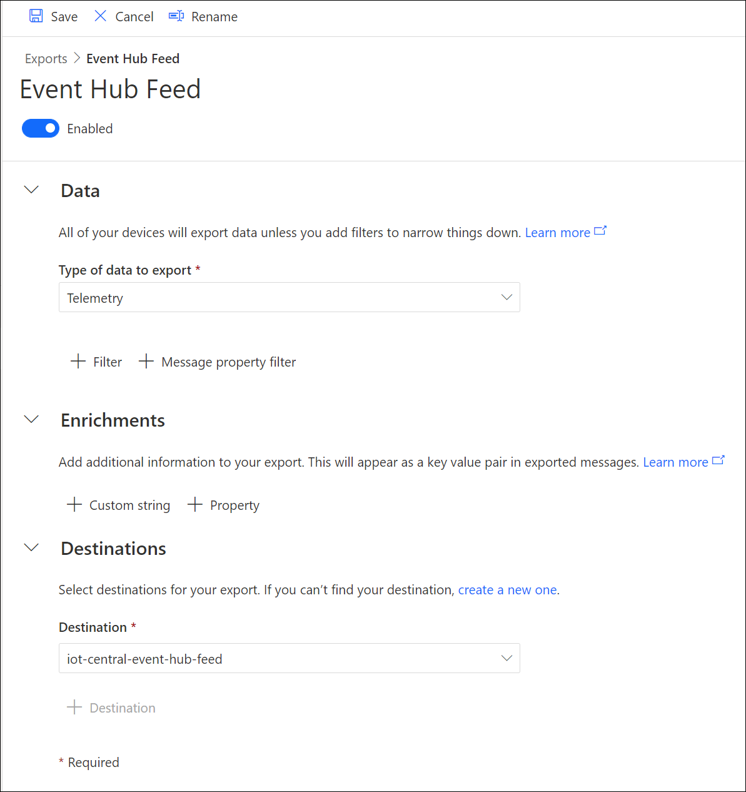

## Exercise 5: Create an Event Hub and continuously export data from IoT Central

Duration: 15 minutes

IoT Central provides a great first stepping stone into a larger IoT solution. A more mature IoT solution typically involves a machine learning model that will process incoming telemetry to logically determine if a failure of a pump is imminent. The first step into this implementation is to create an Event Hub to act as a destination for IoT Central's continuously exported data.

### Task 1: Create an Event Hub

The Event Hub we will be creating will act as a collector for data coming into IoT Central. The receipt of a message into this hub will ultimately serve as a trigger to send data into a machine learning model to determine if a pump is in a failing state. We will also create a Consumer Group on the event hub to serve as an input to an Azure Function that will be created later on in this lab.

1. Log into the [Azure Portal](https://portal.azure.com), and open your **Fabrikam_Oil** resource group.

2. On the top of the screen, select the **Add** button. When the marketplace screen displays, search for and select **Event Hubs**. This will allow you to create a new Event Hub Namespace resource. Select the _Create_ button on the resource overview screen.

    

3. Configure the event hub as follows, select the *Review + create** button, and then **Create**:

   | Field          | Value                                 |
   | -------------- | ------------------------------------- |
   | Subscription   | _select the appropriate subscription_ |
   | Resource Group | Fabrikam_Oil                          |
   | Name           | _anything (must be globally unique)_  |
   | Location       | _select the location nearest to you_  |
   | Pricing Tier   | Standard                              |

   

4. Once the Event Hubs namespace has been created, open it and select the **+ Event Hub** button at the top of the screen.

   

5. In the Create Event Hub form, configure the hub as follows and select the **Create** button:

   | Field        | Value            |
   | ------------ | ---------------- |
   | Name         | iot-central-feed |
   | Partition Count | 2                |
   | Message Retention | 1                |
   | Capture      | Off              |

   

6. Once the Event Hub has been created, open it by selecting _Event Hubs_ in the left-hand menu, and selecting the hub from the list.

   

7. From the top menu, select the **+ Consumer Group** button to create a new consumer group for the hub. Name the consumer group _ingressprocessing_ and select the **Create** button.

   

### Task 2: Configure continuous data export from IoT Central

1. Return to the IoT Central application, from the left-hand menu, select **Data export**. Then select the **+ New** button from the toolbar menu.

   

2. Begin configuring the data export with the following values:

   | Field                | Value                                            |
   | -------------------- | ------------------------------------------------ |
   | Display Name  (Header)        | Event Hub Feed                                   |
   | Enabled (Header)              | On                                               |
   | Type of data to export | Telemetry |
  
3. In the _Destinations_ section, select the _create a new one_ link. Configure the new destination as follows, then select the _Create_ button:

    | Field                | Value                                            |
    | -------------------- | ------------------------------------------------ |
    | Destination name     | iot-central-event-hub-feed                                   |
    | Destination type              | Azure Event Hubs                                               |
    | Connection string | see subsection below on how to get the connection string |
    | Event Hub | iot-central-feed |

   Obtain the connection string as follows:

   - Navigate to your Event Hubs namespace in the Azure portal.

   - Select **Shared access policies** on the left-hand menu, then select the **RootManageSharedAccessKey** and copy the **Connection string-primary key**.

        

   - Return to IoT Central and paste the connection string into the **Connection string** field, then select the `iot-central-feed` event hub you created.

   

   

4. Select the _Save_ button from the toolbar menu on the _Event Hub Feed_ continuous export screen.

5. The Event Hub Feed export will be created, and then started (it may take a few minutes for the export to start). Return to the Data export list to see the current status of the feed.

   
